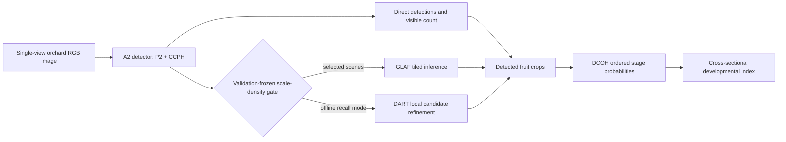

# PruScope

PruScope is a leakage-controlled research pipeline for detecting, counting, and assigning ordered visual-development stages to plum fruit from microfruit to visual maturity.

> **Repository status:** private reviewer candidate `1.0.0-rc.1`. The repository is not a public software or model release. Model weights, internal orchard images, internal annotations, and per-image predictions are intentionally excluded while redistribution and licensing are resolved.

## Why PruScope

Small green fruit are difficult to localize because whole-canopy resizing removes detail, leaves share their color, and occlusion is common. PruScope combines:

- a stride-4 P2 path with a Cross-scale Capacity-Preserving Head (CCPH);
- validation-gated Global–Local Adaptive Fusion (GLAF);
- a Developmental Continuum Ordinal Head (DCOH) for three ordered visual cohorts;
- an optional Density-Aware microfruit Refinement Tail (DART) for recall-critical offline analysis.

The primary output is not a physiological maturity measurement. It is a set of visible-fruit locations, image-level counts, apparent-size strata, ordered stage probabilities, and a cross-sectional developmental index.

## Evidence at a glance

All values below are frozen manuscript results. Definitions and evidence status are documented in [docs/MANUSCRIPT_EVIDENCE_MAP.md](docs/MANUSCRIPT_EVIDENCE_MAP.md).

| Endpoint | Frozen result |
|---|---:|
| Three-seed PruScope A2 small-fruit AP50–95, internal | 0.433 |
| Three-seed PruScope A2 small-fruit AP50–95, external plum | 0.374 |
| Human-audited 240-image reference, overall AP50–95 | 0.498 |
| Small-green COCO-small AP50–95 on that reference | 0.205 |
| CitDet zero-tuning COCO-small AP50 / AR50 | 0.660 / 0.793 |
| DCOH reference-region macro F1 | 0.979 |
| Strict detector-to-stage macro F1 on fruit-bearing images | 0.946 |
| Joint correctly staged fruit recall | 0.459 |

These results are not interchangeable: they use different frozen protocols, checkpoints, operating points, and evidence roles. DART is an optional post-review, validation-frozen analysis and is not presented as a fresh independent confirmation.

## Workflow



## Five-minute reviewer check

The included example is synthetic and tests the metric-audit path; it does not claim model inference without the withheld weights. It uses only the Python standard library.

```bash
python tools/audit_metrics.py \
  --input examples/synthetic_metric_audit/predictions.csv \
  --output reviewer_check.json
python tools/verify_release.py
python -m unittest discover -s tests -v
```

Expected output: `reviewer_check.json` matches `examples/synthetic_metric_audit/expected_summary.json`, release verification prints `PASS`, and the test suite exits with code 0.

## Repository map

| Path | Purpose |
|---|---|
| `src/pruscope/` | CCPH, OSSA, GLAF, DCOH, and DART modules |
| `src/*.py` | training, inference, evaluation, bootstrap, and audit entry points |
| `configs/models/` | detector architecture configurations |
| `paper/` | current manuscript source, review PDF, figures, and figure-generation scripts |
| `evidence/metrics/` | aggregate frozen results and protocol locks; no raw images or annotation coordinates |
| `docs/` | installation, reproduction, reviewer, model, data, and limitation notes |
| `examples/` | redistributable synthetic audit fixture |
| `release/` | single source of release metadata, manifest, and SHA-256 checksums |

## Installation and full analysis

The public-lightweight reviewer check needs only Python 3.10+ and the packages in `requirements-ci.txt`. Re-running model training or inference additionally requires PyTorch, Ultralytics, CUDA for GPU execution, the frozen data partitions, and matching checkpoints. See [docs/INSTALLATION.md](docs/INSTALLATION.md), [docs/REPRODUCIBILITY.md](docs/REPRODUCIBILITY.md), and [MODEL_CARD.md](MODEL_CARD.md).

## Data, weights, and privacy boundary

This repository does **not** contain:

- internal plum-orchard photographs or internal annotations;
- annotator identities or correction histories;
- model checkpoints or third-party foundation weights;
- raw CitDet media/annotations;
- per-image predictions that could disclose internal filenames;
- credentials, login/recovery email addresses, or local machine paths.

External plum data and CitDet remain available from their original sources and under their original terms. See [DATA_CARD.md](DATA_CARD.md) and [THIRD_PARTY_NOTICES.md](THIRD_PARTY_NOTICES.md).

## Review status and limitations

The code, paper, figures, aggregate evidence, metadata checks, and synthetic audit have been assembled for private review. A public release remains blocked until the author/rightsholder confirms code, documentation, weight, and internal-data licensing. No GitHub Release, tag, package-index publication, model-hub deposit, or DOI is claimed. The complete gate is in [RELEASE_READINESS.md](RELEASE_READINESS.md).

## Citation, support, and license

Citation metadata are in [CITATION.cff](CITATION.cff). Questions may be filed through GitHub Issues or sent to the public work contacts in [SUPPORT.md](SUPPORT.md).

No public reuse license has yet been granted. This private reviewer candidate is all rights reserved pending a documented licensing decision; see [LICENSE](LICENSE).
